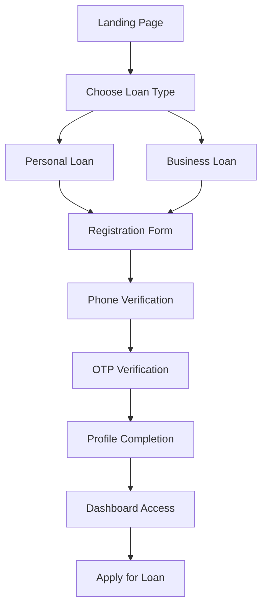
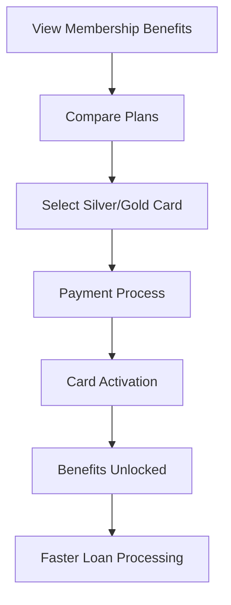
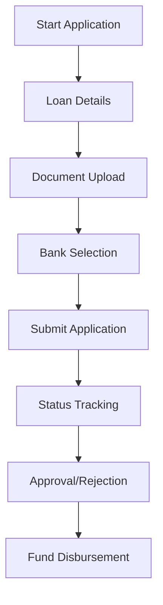

# Product Context

## Problem Statement

### Current Pain Points in Loan Application Process

#### For Customers
1. **Multiple Applications**: Customers must apply separately to each bank, filling out similar forms repeatedly
2. **Lengthy Processing**: Traditional loan applications take weeks or months for approval
3. **Complex Documentation**: Extensive paperwork requirements vary by bank
4. **Lack of Transparency**: Limited visibility into application status and approval chances
5. **High Rejection Rates**: No guidance on which banks are most likely to approve their application

#### For Banks
1. **High Processing Costs**: Manual verification and processing of applications
2. **Poor Lead Quality**: Many unqualified applications waste resources
3. **Customer Acquisition**: Difficulty reaching potential borrowers efficiently
4. **Competition**: Need to offer competitive rates and faster processing

## Solution Overview

RupeekX Clone addresses these pain points by creating a unified platform that:

- **Centralizes Applications**: Single application form for multiple bank partners
- **Accelerates Processing**: Membership-based faster approval (30 min personal, 48 hr business)
- **Simplifies Documentation**: Digital-first approach with minimal paperwork
- **Provides Transparency**: Real-time application tracking and status updates
- **Improves Success Rates**: Pre-qualification and bank matching based on user profile

## User Personas

### Primary Persona: Personal Loan Seeker
**Demographics:**
- Age: 25-45 years
- Income: ₹3-15 Lakhs annually
- Location: Urban and semi-urban India
- Tech-savvy, mobile-first users

**Goals:**
- Quick access to funds for personal needs
- Competitive interest rates
- Minimal documentation
- Fast approval process

**Pain Points:**
- Urgent need for funds
- Complex bank procedures
- High rejection rates
- Long waiting periods

### Secondary Persona: Business Owner
**Demographics:**
- Age: 30-55 years
- Business: Small to medium enterprises
- Revenue: ₹10 Lakhs - ₹5 Crores annually
- Experience: 2+ years in business

**Goals:**
- Business expansion funding
- Working capital management
- Equipment financing
- Cash flow optimization

**Pain Points:**
- Collateral requirements
- Complex business documentation
- Long approval cycles
- High interest rates

### Tertiary Persona: Cash Lending Customer
**Demographics:**
- Age: 25-40 years
- Income: Variable/freelance
- Credit Profile: May have limited credit history
- Usage: Frequent small loans

**Goals:**
- Quick access to small amounts
- Flexible repayment options
- No collateral requirements
- Subscription-based benefits

## User Journeys

### 1. New Customer Registration Journey

**Key Touchpoints:**
1. **Discovery**: Landing page with clear value proposition
2. **Registration**: Simple form with minimal required fields
3. **Verification**: OTP-based phone verification for security
4. **Onboarding**: Profile completion with address and preferences
5. **First Application**: Guided loan application process

### 2. Membership Card Purchase Journey

**Benefits Communication:**
- **Silver Card**: 30-minute personal loan processing
- **Gold Card**: 48-hour business loan processing
- **Both**: Preferential rates, priority support

### 3. Loan Application Journey

**Application Steps:**
1. **Loan Details**: Amount, tenure, purpose
2. **Documentation**: Digital upload of required documents
3. **Bank Matching**: System suggests best-fit banks
4. **Submission**: Single application to multiple banks
5. **Tracking**: Real-time status updates
6. **Decision**: Approval with terms or rejection with feedback

## User Experience Goals

### Primary UX Objectives

#### 1. Simplicity
- **One-Click Applications**: Minimal form fields, smart defaults
- **Progressive Disclosure**: Show only relevant information at each step
- **Clear Navigation**: Intuitive menu structure and breadcrumbs
- **Mobile-First Design**: Optimized for smartphone usage

#### 2. Speed
- **Fast Loading**: Sub-3 second page load times
- **Quick Registration**: Complete signup in under 2 minutes
- **Instant Verification**: OTP delivery within 30 seconds
- **Rapid Applications**: Complete loan application in 5-10 minutes

#### 3. Trust & Security
- **Visual Security Indicators**: SSL certificates, security badges
- **Transparent Process**: Clear explanation of each step
- **Data Protection**: Privacy policy and data handling transparency
- **Bank Partnerships**: Display partner logos and certifications

#### 4. Accessibility
- **Multi-Language Support**: Hindi and English interfaces
- **Screen Reader Compatible**: WCAG 2.1 AA compliance
- **Keyboard Navigation**: Full functionality without mouse
- **High Contrast Mode**: Support for visual impairments

### Secondary UX Objectives

#### 1. Personalization
- **Smart Recommendations**: Bank suggestions based on profile
- **Customized Dashboard**: Relevant information and actions
- **Preference Memory**: Remember user choices and settings
- **Dynamic Content**: Personalized offers and promotions

#### 2. Support
- **Contextual Help**: Inline guidance and tooltips
- **Live Chat**: Real-time customer support
- **FAQ Integration**: Searchable help articles
- **Video Tutorials**: Step-by-step process guides

## Success Metrics

### User Experience Metrics

#### Engagement Metrics
- **Registration Completion Rate**: Target >80%
- **Application Completion Rate**: Target >70%
- **Time to Complete Application**: Target <10 minutes
- **Return User Rate**: Target >60% within 30 days

#### Satisfaction Metrics
- **Net Promoter Score (NPS)**: Target >50
- **Customer Satisfaction (CSAT)**: Target >4.5/5
- **Support Ticket Volume**: Target <5% of users
- **App Store Rating**: Target >4.0/5

#### Conversion Metrics
- **Registration to Application**: Target >40%
- **Application to Approval**: Target >60%
- **Approval to Disbursement**: Target >90%
- **Membership Card Adoption**: Target >25% of users

### Business Impact Metrics

#### Revenue Metrics
- **Average Revenue Per User (ARPU)**: Track membership and commission revenue
- **Customer Lifetime Value (CLV)**: Measure long-term user value
- **Conversion Rate**: Applications to successful loans
- **Retention Rate**: Monthly active users

#### Operational Metrics
- **Processing Time Reduction**: Compare to traditional methods
- **Cost Per Acquisition (CPA)**: Marketing efficiency
- **Support Efficiency**: Response time and resolution rate
- **System Uptime**: Platform reliability

## Competitive Advantages

### 1. Speed Advantage
- **30-Minute Personal Loans**: Industry-leading processing time
- **48-Hour Business Loans**: Faster than traditional 2-4 week process
- **Real-Time Status Updates**: Immediate feedback on applications

### 2. Convenience Advantage
- **Single Application**: Apply to multiple banks simultaneously
- **Digital-First Process**: Minimal paperwork and branch visits
- **Mobile-Optimized**: Complete process on smartphone

### 3. Value Advantage
- **Competitive Rates**: Access to multiple bank offers
- **Transparent Pricing**: No hidden fees or charges
- **Membership Benefits**: Additional value through cards and subscriptions

### 4. Trust Advantage
- **Bank Partnerships**: Established relationships with major banks
- **Secure Platform**: Enterprise-grade security and compliance
- **Customer Support**: Dedicated assistance throughout the process

## Future Vision

### Short-term Goals (6 months)
- Complete API implementation for all loan types
- Launch admin panel for loan processing
- Integrate payment gateway for memberships
- Implement document upload and verification

### Medium-term Goals (1 year)
- Mobile app development
- Advanced analytics and reporting
- AI-powered loan matching
- Expanded bank partner network

### Long-term Goals (2+ years)
- Full fintech platform with multiple financial products
- Credit scoring and risk assessment
- International expansion
- B2B lending solutions
