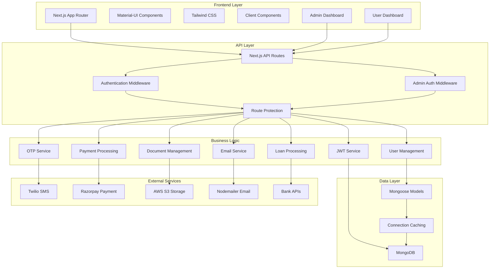
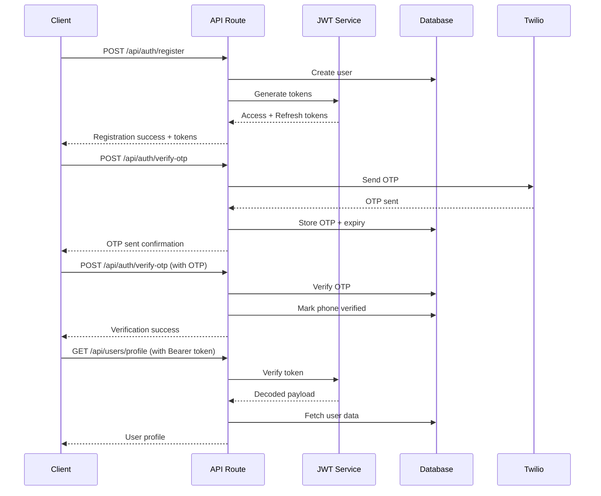

# System Patterns

## Architecture Overview

### High-Level Architecture



## Next.js App Router Structure

### Directory Organization

```
src/
├── app/                          # Next.js App Router
│   ├── api/                      # API Routes
│   │   ├── auth/                 # Authentication endpoints
│   │   │   ├── login/route.ts
│   │   │   ├── register/route.ts
│   │   │   ├── verify-otp/route.ts
│   │   │   ├── logout/route.ts
│   │   │   ├── refresh-token/route.ts
│   │   │   ├── verify-email/route.ts
│   │   │   ├── forgot-password/route.ts
│   │   │   └── reset-password/route.ts
│   │   ├── users/                # User management
│   │   │   └── profile/route.ts
│   │   ├── loans/                # Loan operations
│   │   │   ├── route.ts
│   │   │   ├── apply/route.ts
│   │   │   └── [id]/route.ts
│   │   ├── memberships/          # Membership management
│   │   │   ├── types/route.ts
│   │   │   ├── purchase/route.ts
│   │   │   └── me/route.ts
│   │   ├── payments/             # Payment processing
│   │   │   └── create-order/route.ts
│   │   ├── documents/            # Document management
│   │   │   └── upload/route.ts
│   │   ├── contact/route.ts      # Contact form
│   │   ├── content/              # Static content
│   │   │   └── [slug]/route.ts
│   │   ├── bank-partners/route.ts # Bank partners
│   │   └── admin/                # Admin endpoints
│   │       ├── login/route.ts
│   │       ├── profile/route.ts
│   │       ├── dashboard/
│   │       │   └── stats/route.ts
│   │       ├── users/
│   │       │   ├── route.ts
│   │       │   ├── [id]/route.ts
│   │       │   ├── [id]/suspend/route.ts
│   │       │   └── [id]/activate/route.ts
│   │       └── loans/
│   │           ├── route.ts
│   │           ├── [id]/route.ts
│   │           ├── [id]/approve/route.ts
│   │           └── [id]/reject/route.ts
│   ├── customer/                 # Customer portal pages
│   │   ├── page.tsx
│   │   ├── signup/page.tsx
│   │   ├── verify-otp/page.tsx
│   │   ├── forgot-password/page.tsx
│   │   └── reset-password/page.tsx
│   ├── dashboard/                # User dashboard
│   │   ├── page.tsx
│   │   ├── loans/
│   │   │   └── [id]/page.tsx
│   │   └── documents/page.tsx
│   ├── admin/                    # Admin dashboard
│   │   ├── layout.tsx
│   │   ├── page.tsx
│   │   ├── login/page.tsx
│   │   ├── users/
│   │   │   ├── page.tsx
│   │   │   └── [id]/page.tsx
│   │   └── loans/
│   │       ├── page.tsx
│   │       └── [id]/page.tsx
│   ├── digital/                  # Loan application pages
│   │   ├── personalLoan/page.tsx
│   │   └── businessLoan/page.tsx
│   ├── products/                 # Membership card pages
│   │   ├── silver-membership-card/page.tsx
│   │   ├── gold-membership-card/page.tsx
│   │   └── cashlending-subscription/page.tsx
│   ├── layout.tsx                # Root layout
│   ├── page.tsx                  # Homepage
│   └── globals.css               # Global styles
├── components/                   # Reusable components
│   ├── Common/                   # Common components
│   │   ├── Button.tsx
│   │   ├── Input.tsx
│   │   ├── Card.tsx
│   │   ├── LoadingSpinner.tsx
│   │   ├── Modal.tsx
│   │   ├── Alert.tsx
│   │   └── Badge.tsx
│   ├── Forms/                    # Form components
│   │   ├── ContactForm.tsx
│   │   └── LoanApplicationForm.tsx
│   ├── Layout/                   # Layout components
│   │   ├── Header.tsx
│   │   └── Footer.tsx
│   ├── Business/                 # Business components
│   │   ├── MembershipCard.tsx
│   │   ├── TestimonialCarousel.tsx
│   │   ├── BankPartners.tsx
│   │   └── FAQAccordion.tsx
│   ├── Dashboard/                # Dashboard components
│   │   ├── ApplicationCard.tsx
│   │   ├── MembershipStatus.tsx
│   │   ├── QuickActions.tsx
│   │   ├── StatusStepper.tsx
│   │   └── DocumentUpload.tsx
│   ├── Admin/                    # Admin components
│   │   ├── StatsCard.tsx
│   │   ├── DataTable.tsx
│   │   └── StatusBadge.tsx
│   ├── ThemeRegistry/
│   │   ├── ThemeRegistry.tsx
│   │   ├── theme.ts
│   │   └── EmotionCache.tsx
│   └── AuthBackgroundRotator.tsx
├── lib/                          # Utility libraries
│   ├── authMiddleware.ts
│   ├── adminAuthMiddleware.ts
│   ├── axios.ts
│   ├── jwt.ts
│   ├── mongodb.ts
│   ├── otpService.ts
│   ├── razorpay.ts
│   ├── s3Upload.ts
│   ├── validation.ts
│   ├── emailService.ts
│   └── useAxios.ts
└── models/                       # Database models
    ├── User.ts
    ├── LoanApplication.ts
    ├── MembershipCard.ts
    ├── MembershipCardType.ts
    ├── CashLendingSubscription.ts
    ├── CashLendingSubscriptionPlan.ts
    ├── BankPartner.ts
    ├── Enquiry.ts
    └── StaticContent.ts
```

## Authentication Architecture

### JWT Token Flow



### Authentication Middleware Pattern

```typescript
// Higher-Order Function for route protection
export const withAuth = (handler: AppRouterApiHandler) => {
  return async (req: NextRequestWithUser, context: { params: Record<string, unknown> }) => {
    try {
      const authHeader = req.headers.get('Authorization');
      
      if (!authHeader || !authHeader.startsWith('Bearer ')) {
        return NextResponse.json({ error: 'Unauthorized: No token provided' }, { status: 401 });
      }
      
      const token = authHeader.substring(7);
      const decodedPayload = verifyToken(token, ACCESS_TOKEN_SECRET);
      req.user = decodedPayload;
      
      return handler(req, context);
    } catch (error) {
      // Handle token verification errors
      return NextResponse.json({ error: 'Unauthorized' }, { status: 401 });
    }
  };
};

// Admin Authentication Middleware
export const withAdminAuth = (handler: AdminApiHandler) => {
  return async (req: NextRequestWithAdmin) => {
    try {
      const authHeader = req.headers.get('Authorization');
      
      if (!authHeader || !authHeader.startsWith('Bearer ')) {
        return NextResponse.json({ error: 'Unauthorized: No token provided' }, { status: 401 });
      }
      
      const token = authHeader.substring(7);
      const decodedPayload = verifyToken(token, ACCESS_TOKEN_SECRET);
      
      // Check if user is admin
      if (decodedPayload.role !== 'admin') {
        return NextResponse.json({ error: 'Forbidden: Admin access required' }, { status: 403 });
      }
      
      req.admin = decodedPayload;
      
      return handler(req);
    } catch (error) {
      return NextResponse.json({ error: 'Unauthorized' }, { status: 401 });
    }
  };
};
```

## Database Patterns

### MongoDB Connection Caching

```typescript
// Connection caching pattern
let cachedDb: Db | null = null;

export async function connectToDatabase(): Promise<Db> {
  if (cachedDb) {
    return cachedDb;
  }
  
  const client = new MongoClient(MONGODB_URI);
  await client.connect();
  const db = client.db(dbName);
  cachedDb = db;
  return db;
}
```

### Mongoose Model Pattern

```typescript
// User model with pre-save hooks and methods
const userSchema: Schema<IUser> = new Schema({
  // Schema definition
}, {
  timestamps: true,
  toJSON: {
    transform(doc, ret) {
      delete ret.password;
      delete ret.phone_otp;
      return ret;
    }
  }
});

// Pre-save hook for password hashing
userSchema.pre<IUser>('save', async function (next) {
  if (!this.isModified('password')) return next();
  const salt = await bcrypt.genSalt(10);
  this.password = await bcrypt.hash(this.password, salt);
  next();
});

// Instance method for password comparison
userSchema.methods.comparePassword = async function(candidatePassword: string): Promise<boolean> {
  return bcrypt.compare(candidatePassword, this.password);
};
```

## Component Architecture

### Material-UI Theme Integration

```typescript
// ThemeRegistry wrapper pattern
export default function RootLayout({ children }: { children: React.ReactNode }) {
  return (
    <html lang="en">
      <body>
        <ThemeRegistry>
          <Box sx={{ display: 'flex', flexDirection: 'column', minHeight: '100vh' }}>
            <Navbar />
            <Container component="main" sx={{ flexGrow: 1, mt: 3, mb: 3 }}>
              {children}
            </Container>
            <Footer />
          </Box>
        </ThemeRegistry>
      </body>
    </html>
  );
}
```

### Server vs Client Component Pattern

```typescript
// Server Component (default)
export default function HomePage() {
  return (
    <Container>
      <Typography variant="h3">Welcome to RupeekX</Typography>
      <Button component={Link} href="/digital/personalLoan">
        Apply for Personal Loan
      </Button>
    </Container>
  );
}

// Client Component (when interactivity needed)
'use client';
export default function VerifyOTPPage() {
  const [otp, setOtp] = useState('');
  const [loading, setLoading] = useState(false);
  
  const handleSubmit = async (e: FormEvent) => {
    // Handle form submission
  };
  
  return (
    <form onSubmit={handleSubmit}>
      {/* Form content */}
    </form>
  );
}
```

## API Route Patterns

### Standard API Route Structure

```typescript
// GET route pattern
export async function GET(req: NextRequest) {
  try {
    const db = await connectToDatabase();
    const data = await db.collection('users').find().toArray();
    
    return NextResponse.json({ data }, { status: 200 });
  } catch (error) {
    console.error('Error:', error);
    return NextResponse.json({ error: 'Internal server error' }, { status: 500 });
  }
}

// POST route pattern
export async function POST(req: NextRequest) {
  try {
    const body = await req.json();
    
    // Validation
    if (!body.requiredField) {
      return NextResponse.json({ error: 'Missing required field' }, { status: 400 });
    }
    
    // Business logic
    const result = await processData(body);
    
    return NextResponse.json({ result }, { status: 201 });
  } catch (error) {
    console.error('Error:', error);
    return NextResponse.json({ error: 'Internal server error' }, { status: 500 });
  }
}
```

### Protected Route Pattern

```typescript
// Using withAuth HOF
const protectedHandler = async (req: NextRequestWithUser) => {
  const user = req.user; // Available from middleware
  const db = await connectToDatabase();
  const userData = await db.collection('users').findOne({ _id: user.userId });
  
  return NextResponse.json({ user: userData });
};

export const GET = withAuth(protectedHandler);
```

## Error Handling Patterns

### Standardized Error Responses

```typescript
// Error response structure
interface ErrorResponse {
  error: string;
  details?: Record<string, string>;
  code?: string;
}

// Validation errors
return NextResponse.json({
  error: 'Validation failed',
  details: {
    email: 'Invalid email format',
    phone: 'Phone number is required'
  }
}, { status: 400 });

// Authentication errors
return NextResponse.json({
  error: 'Unauthorized: Invalid token'
}, { status: 401 });

// Server errors
return NextResponse.json({
  error: 'Internal server error'
}, { status: 500 });
```

### Try-Catch Pattern

```typescript
export async function POST(req: NextRequest) {
  try {
    // Main logic here
    const result = await processRequest(req);
    return NextResponse.json({ result }, { status: 200 });
  } catch (error) {
    console.error('API Error:', error);
    
    if (error instanceof ValidationError) {
      return NextResponse.json({ error: error.message }, { status: 400 });
    }
    
    if (error instanceof AuthenticationError) {
      return NextResponse.json({ error: 'Unauthorized' }, { status: 401 });
    }
    
    return NextResponse.json({ error: 'Internal server error' }, { status: 500 });
  }
}
```

## Security Patterns

### Password Security

```typescript
// Password hashing with bcrypt
const saltRounds = 10;
const hashedPassword = await bcrypt.hash(password, saltRounds);

// Password comparison
const isValid = await bcrypt.compare(candidatePassword, hashedPassword);
```

### JWT Security

```typescript
// Token generation with expiration
const accessToken = jwt.sign(payload, ACCESS_TOKEN_SECRET, { expiresIn: '15m' });
const refreshToken = jwt.sign(payload, REFRESH_TOKEN_SECRET, { expiresIn: '7d' });

// Token verification
const decoded = jwt.verify(token, secret) as AuthPayload;
```

### Input Validation

```typescript
// Email validation
const emailRegex = /^[^\s@]+@[^\s@]+\.[^\s@]+$/;
if (!emailRegex.test(email)) {
  throw new ValidationError('Invalid email format');
}

// Phone validation (Indian format)
const phoneRegex = /^[6-9]\d{9}$/;
if (!phoneRegex.test(phone)) {
  throw new ValidationError('Invalid phone number format');
}

// Pincode validation (Indian format)
const pincodeRegex = /^[1-9][0-9]{5}$/;
if (!pincodeRegex.test(pincode)) {
  throw new ValidationError('Invalid pincode format');
}
```

## State Management Patterns

### Local State with React Hooks

```typescript
// Form state management
const [formData, setFormData] = useState({
  email: '',
  phone: '',
  password: ''
});

const [loading, setLoading] = useState(false);
const [errors, setErrors] = useState<Record<string, string>>({});

// Form submission handler
const handleSubmit = async (e: FormEvent) => {
  e.preventDefault();
  setLoading(true);
  setErrors({});
  
  try {
    const response = await fetch('/api/auth/register', {
      method: 'POST',
      headers: { 'Content-Type': 'application/json' },
      body: JSON.stringify(formData)
    });
    
    if (!response.ok) {
      const errorData = await response.json();
      setErrors(errorData.details || { general: errorData.error });
      return;
    }
    
    // Handle success
  } catch (error) {
    setErrors({ general: 'An unexpected error occurred' });
  } finally {
    setLoading(false);
  }
};
```

### API Integration Pattern

```typescript
// Custom hook for API calls
export const useAxios = () => {
  const [loading, setLoading] = useState(false);
  const [error, setError] = useState<string | null>(null);
  
  const makeRequest = async (url: string, options: RequestInit = {}) => {
    setLoading(true);
    setError(null);
    
    try {
      const response = await fetch(url, {
        headers: {
          'Content-Type': 'application/json',
          ...options.headers
        },
        ...options
      });
      
      if (!response.ok) {
        throw new Error(`HTTP error! status: ${response.status}`);
      }
      
      return await response.json();
    } catch (err) {
      setError(err instanceof Error ? err.message : 'An error occurred');
      throw err;
    } finally {
      setLoading(false);
    }
  };
  
  return { makeRequest, loading, error };
};
```

## Payment Integration Patterns

### Razorpay Integration

```typescript
// Razorpay order creation
export const createRazorpayOrder = async (amount: number, currency: string = 'INR') => {
  const options = {
    amount: amount * 100, // Convert to paise
    currency,
    receipt: `order_${Date.now()}`,
    notes: {
      order_type: 'membership_purchase'
    }
  };

  try {
    const order = await razorpay.orders.create(options);
    return {
      success: true,
      order: {
        id: order.id,
        amount: order.amount,
        currency: order.currency,
        receipt: order.receipt
      }
    };
  } catch (error) {
    return {
      success: false,
      error: error instanceof Error ? error.message : 'Payment order creation failed'
    };
  }
};

// Payment verification
export const verifyPayment = async (paymentData: any) => {
  const { razorpay_order_id, razorpay_payment_id, razorpay_signature } = paymentData;
  
  const body = razorpay_order_id + "|" + razorpay_payment_id;
  const expectedSignature = crypto
    .createHmac("sha256", process.env.RAZORPAY_WEBHOOK_SECRET!)
    .update(body.toString())
    .digest("hex");

  return expectedSignature === razorpay_signature;
};
```

## Document Management Patterns

### AWS S3 Integration

```typescript
// S3 document upload
export const uploadToS3 = async (file: Buffer, fileName: string, contentType: string) => {
  const key = `documents/${Date.now()}-${fileName}`;
  
  const uploadParams = {
    Bucket: process.env.AWS_S3_BUCKET_NAME!,
    Key: key,
    Body: file,
    ContentType: contentType,
    ACL: 'private' as const
  };

  try {
    const result = await s3Client.send(new PutObjectCommand(uploadParams));
    return {
      success: true,
      key,
      url: `https://${process.env.AWS_S3_BUCKET_NAME}.s3.amazonaws.com/${key}`
    };
  } catch (error) {
    return {
      success: false,
      error: error instanceof Error ? error.message : 'Upload failed'
    };
  }
};

// Generate presigned URL for document access
export const generatePresignedUrl = async (key: string, expiresIn: number = 3600) => {
  const command = new GetObjectCommand({
    Bucket: process.env.AWS_S3_BUCKET_NAME!,
    Key: key
  });

  try {
    const url = await getSignedUrl(s3Client, command, { expiresIn });
    return { success: true, url };
  } catch (error) {
    return {
      success: false,
      error: error instanceof Error ? error.message : 'URL generation failed'
    };
  }
};
```

## Email Service Patterns

### Nodemailer Integration

```typescript
// Email service configuration
export class EmailService {
  private static transporter = nodemailer.createTransporter({
    host: process.env.SMTP_HOST,
    port: parseInt(process.env.SMTP_PORT || '587'),
    secure: false,
    auth: {
      user: process.env.SMTP_USER,
      pass: process.env.SMTP_PASS
    }
  });

  // Send email with template
  static async sendEmail({ to, subject, html }: EmailOptions) {
    try {
      const info = await this.transporter.sendMail({
        from: process.env.SMTP_FROM,
        to,
        subject,
        html
      });

      return {
        success: true,
        messageId: info.messageId
      };
    } catch (error) {
      return {
        success: false,
        error: error instanceof Error ? error.message : 'Email sending failed'
      };
    }
  }

  // Send loan approval notification
  static async sendLoanApprovalNotification(
    to: string,
    name: string,
    applicationId: string,
    approvedAmount: number,
    interestRate: number,
    tenureMonths: number
  ) {
    const html = `
      <!DOCTYPE html>
      <html>
        <head>
          <meta charset="utf-8">
          <title>Loan Application Approved - RupeekX</title>
        </head>
        <body style="font-family: Arial, sans-serif; line-height: 1.6; color: #333;">
          <div style="max-width: 600px; margin: 0 auto; padding: 20px;">
            <h2 style="color: #4caf50;">🎉 Congratulations! Your Loan is Approved</h2>
            <p>Hi ${name},</p>
            <p>Great news! Your loan application has been approved. Here are the details:</p>
            <div style="background-color: #e8f5e8; padding: 20px; border-radius: 5px; margin: 20px 0; border-left: 4px solid #4caf50;">
              <p><strong>Application ID:</strong> ${applicationId}</p>
              <p><strong>Approved Amount:</strong> ₹${approvedAmount.toLocaleString()}</p>
              <p><strong>Interest Rate:</strong> ${interestRate}% per annum</p>
              <p><strong>Loan Tenure:</strong> ${tenureMonths} months</p>
              <p><strong>Status:</strong> Approved</p>
            </div>
            <p>Next steps:</p>
            <ul>
              <li>Review the loan terms and conditions</li>
              <li>Sign the loan agreement</li>
              <li>Complete any remaining documentation</li>
              <li>Funds will be disbursed within 24-48 hours</li>
            </ul>
            <p>You can log into your account to view the complete loan details and next steps.</p>
          </div>
        </body>
      </html>
    `;

    return this.sendEmail({
      to,
      subject: 'Loan Application Approved - RupeekX',
      html
    });
  }
}
```

## Validation Patterns

### Zod Schema Validation

```typescript
// Comprehensive validation schemas
export const userRegistrationSchema = z.object({
  full_name: z.string().min(2, 'Full name must be at least 2 characters'),
  email: z.string().email('Invalid email format'),
  phone_number: z.string().regex(/^[6-9]\d{9}$/, 'Invalid phone number format'),
  password: z.string().min(8, 'Password must be at least 8 characters'),
  confirm_password: z.string()
}).refine((data) => data.password === data.confirm_password, {
  message: "Passwords don't match",
  path: ["confirm_password"]
});

export const loanApplicationSchema = z.object({
  loan_type: z.enum(['personal', 'business']),
  amount_requested: z.number().min(10000, 'Minimum amount is ₹10,000').max(10000000, 'Maximum amount is ₹1 crore'),
  purpose: z.string().min(10, 'Purpose must be at least 10 characters'),
  employment_type: z.enum(['salaried', 'self_employed']),
  monthly_income: z.number().min(15000, 'Minimum monthly income is ₹15,000'),
  company_name: z.string().min(2, 'Company name is required'),
  work_experience: z.number().min(1, 'Minimum work experience is 1 year'),
  address: z.object({
    street: z.string().min(5, 'Street address is required'),
    city: z.string().min(2, 'City is required'),
    state: z.string().min(2, 'State is required'),
    pincode: z.string().regex(/^[1-9][0-9]{5}$/, 'Invalid pincode format'),
    country: z.string().default('India')
  })
});

export const loanApprovalSchema = z.object({
  approved_amount: z.number().min(1000, 'Minimum amount is ₹1,000'),
  interest_rate: z.number().min(1, 'Interest rate must be at least 1%').max(30, 'Interest rate cannot exceed 30%'),
  tenure_months: z.number().min(1, 'Tenure must be at least 1 month').max(60, 'Tenure cannot exceed 60 months'),
  processing_fee: z.number().min(0, 'Processing fee cannot be negative'),
  remarks: z.string().optional()
});

// Validation helper function
export const validateData = <T>(schema: z.ZodSchema<T>, data: unknown) => {
  try {
    const validatedData = schema.parse(data);
    return { success: true, data: validatedData };
  } catch (error) {
    if (error instanceof z.ZodError) {
      const errors: Record<string, string> = {};
      error.errors.forEach((err) => {
        if (err.path.length > 0) {
          errors[err.path.join('.')] = err.message;
        }
      });
      return { success: false, errors };
    }
    return { success: false, errors: { general: 'Validation failed' } };
  }
};
```

## Performance Patterns

### Database Query Optimization

```typescript
// Indexed queries with aggregation
const loanApplications = await LoanApplication.aggregate([
  { $match: { user_id: new ObjectId(userId) } },
  {
    $lookup: {
      from: 'users',
      localField: 'user_id',
      foreignField: '_id',
      as: 'user_details'
    }
  },
  { $unwind: '$user_details' },
  {
    $project: {
      'user_details.password': 0,
      'user_details.phone_otp': 0
    }
  },
  { $sort: { createdAt: -1 } },
  { $skip: skip },
  { $limit: limit }
]);

// Pagination with total count
const totalCount = await LoanApplication.countDocuments({ user_id: new ObjectId(userId) });
const totalPages = Math.ceil(totalCount / limit);

// Response with pagination metadata
return NextResponse.json({
  data: loanApplications,
  pagination: {
    currentPage: page,
    totalPages,
    totalCount,
    hasNextPage: page < totalPages,
    hasPrevPage: page > 1
  }
});
```

### Caching Strategy

```typescript
// Connection caching
let cachedDb: Db | null = null;

// Response caching for static data
const CACHE_DURATION = 5 * 60 * 1000; // 5 minutes
let cachedBankPartners: any[] | null = null;
let cacheTimestamp: number | null = null;

export async function getBankPartners() {
  if (cachedBankPartners && cacheTimestamp && 
      Date.now() - cacheTimestamp < CACHE_DURATION) {
    return cachedBankPartners;
  }
  
  const db = await connectToDatabase();
  const partners = await db.collection('bank_partners').find({ is_active: true }).toArray();
  
  cachedBankPartners = partners;
  cacheTimestamp = Date.now();
  
  return partners;
}

// Component-level caching with SWR
export const useBankPartners = () => {
  const { data, error, isLoading } = useSWR('/api/bank-partners', fetcher, {
    revalidateOnFocus: false,
    revalidateOnReconnect: false,
    refreshInterval: 5 * 60 * 1000 // 5 minutes
  });

  return {
    bankPartners: data,
    isLoading,
    error
  };
};
```

## Testing Patterns

### API Route Testing Structure

```typescript
// Test structure for API routes
describe('/api/auth/register', () => {
  beforeEach(() => {
    // Setup test database
  });
  
  afterEach(() => {
    // Cleanup test data
  });
  
  it('should register a new user successfully', async () => {
    const userData = {
      full_name: 'Test User',
      email: 'test@example.com',
      phone_number: '9876543210',
      password: 'password123'
    };
    
    const response = await fetch('/api/auth/register', {
      method: 'POST',
      headers: { 'Content-Type': 'application/json' },
      body: JSON.stringify(userData)
    });
    
    expect(response.status).toBe(201);
    const data = await response.json();
    expect(data.user.email).toBe(userData.email);
  });
  
  it('should reject duplicate email', async () => {
    // Test duplicate email scenario
  });
});
```

## Deployment Patterns

### Environment Configuration

```typescript
// Environment variable validation
const requiredEnvVars = [
  'MONGODB_URI',
  'ACCESS_TOKEN_SECRET',
  'REFRESH_TOKEN_SECRET',
  'TWILIO_ACCOUNT_SID',
  'TWILIO_AUTH_TOKEN'
];

requiredEnvVars.forEach(envVar => {
  if (!process.env[envVar]) {
    throw new Error(`Missing required environment variable: ${envVar}`);
  }
});
```

### Production Considerations

```typescript
// Production error handling
if (process.env.NODE_ENV === 'production') {
  // Log errors to external service
  console.error = (message, ...args) => {
    // Send to logging service
  };
}

// Security headers
export async function middleware(req: NextRequest) {
  const response = NextResponse.next();
  
  response.headers.set('X-Frame-Options', 'DENY');
  response.headers.set('X-Content-Type-Options', 'nosniff');
  response.headers.set('Referrer-Policy', 'origin-when-cross-origin');
  
  return response;
}
```
